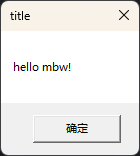
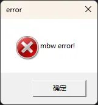
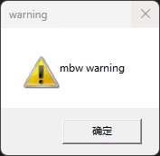
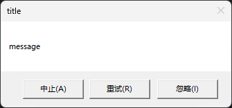

# mbw

Using the Windows API to pop up a message box, with four methods available: simple message, simple error/warning message, and custom message box. This feature is only supported on Windows.

Other languages: [简体中文](README_zh.md), (Currently unable to translate more)

<!-- TOC -->
* [mbw](#mbw)
* [How to Use](#how-to-use)
* [Code Examples](#code-examples)
  * [Pop up a message box](#pop-up-a-message-box)
  * [Pop up an error message box](#pop-up-an-error-message-box)
  * [Pop up a warning message box](#pop-up-a-warning-message-box)
  * [Pop up a custom message box](#pop-up-a-custom-message-box)
<!-- TOC -->

# How to Use

```shell
go get -u github.com/skys-mission/gout/go/gui/win/mbw
```

# Code Examples

## Pop up a message box

```go
package main

import (
	"fmt"

	"github.com/skys-mission/gout/go/gui/win/mbw"
)

func main() {
	if err := mbw.PopMsg("title", "hello mbw!"); err != nil {
		fmt.Printf("Error: %v\n", err)
		return
	}
}

```

**Output Example**



Note that the "OK" button text is provided by the system, not by this library, and will change with the system language.

## Pop up an error message box

```go
package main

import (
	"fmt"

	"github.com/skys-mission/gout/go/gui/win/mbw"
)

func main() {
	if err := mbw.PopErrMsg("mbw error!"); err != nil {
		fmt.Printf("Error: %v\n", err)
		return
	}
}

```

**Output Example**



Note that the "OK" button text is provided by the system, not by this library, and will change with the system language.

## Pop up a warning message box

```go
package main

import (
	"fmt"

	"github.com/skys-mission/gout/go/gui/win/mbw"
)

func main() {
	if err := mbw.PopWarningMsg("mbw warning"); err != nil {
		fmt.Printf("Error: %v\n", err)
		return
	}
}

```

**Output Example**



Note that the "OK" button text is provided by the system, not by this library, and will change with the system language.

## Pop up a custom message box

```go
package main

import (
	"fmt"

	"github.com/skys-mission/gout/go/gui/win/mbw"
)

func main() {
	cb, err := mbw.PopCustomMsg(
		"title",
		"message",
		mbw.MB_ABORTRETRYIGNORE,
		0)
	if err != nil {
		fmt.Printf("Error: %v\n", err)
		return
	}
	switch cb {
	case mbw.ID_RETRY:
		fmt.Println("retry button clicked")
	case mbw.ID_ABORT:
		fmt.Println("abort button clicked")
	default:
		fmt.Printf("%v clicked\n", cb)
	}
}

```

**Output Example**



```cmd
retry button clicked
Process finished with the exit code 0
```

The text on the buttons is provided by the system and will change with the system language.