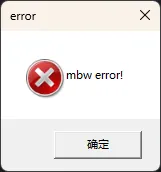
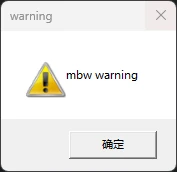

# mbw

通过windows API 弹出一个消息框。有简单消息，简单错误/警告消息，自定义消息框四个方法。仅支持Windows。

其它语言：[English](README.md), (Currently unable to translate more)

<!-- TOC -->
* [mbw](#mbw)
* [如何食用](#如何食用)
* [代码样例](#代码样例)
  * [弹出一个消息框](#弹出一个消息框)
  * [弹出错误信息消息框](#弹出错误信息消息框)
  * [弹出警告信息消息框](#弹出警告信息消息框)
  * [弹出自定义消息框](#弹出自定义消息框)
<!-- TOC -->

# 如何食用

```shell
go get -u github.com/skys-mission/gout/go/gui/win/mbw
```

# 代码样例

## 弹出一个消息框

```go
package main

import (
	"fmt"

	"github.com/skys-mission/gout/go/gui/win/mbw"
)

func main() {
	if err := mbw.PopMsg("title", "hello mbw!"); err != nil {
		fmt.Printf("Error: %v\n", err)
		return
	}
}

```

**输出样例**


注意这里的"确定"按钮文字是系统给出的，并不是本库给出的，会随着系统语言变化而变化

## 弹出错误信息消息框

```go
package main

import (
	"fmt"

	"github.com/skys-mission/gout/go/gui/win/mbw"
)

func main() {
	if err := mbw.PopErrMsg("mbw error!"); err != nil {
		fmt.Printf("Error: %v\n", err)
		return
	}
}

```

**输出样例**



注意这里的"确定"按钮文字是系统给出的，并不是本库给出的，会随着系统语言变化而变化

## 弹出警告信息消息框

```go
package main

import (
	"fmt"

	"github.com/skys-mission/gout/go/gui/win/mbw"
)

func main() {
	if err := mbw.PopWarningMsg("mbw warning"); err != nil {
		fmt.Printf("Error: %v\n", err)
		return
	}
}

```

**输出样例**



注意这里的"确定"按钮文字是系统给出的，并不是本库给出的，会随着系统语言变化而变化

## 弹出自定义消息框

```go
package main

import (
	"fmt"

	"github.com/skys-mission/gout/go/gui/win/mbw"
)

func main() {
	cb, err := mbw.PopCustomMsg(
		"title",
		"message",
		mbw.MB_ABORTRETRYIGNORE,
		0)
	if err != nil {
		fmt.Printf("Error: %v\n", err)
		return
	}
	switch cb {
	case mbw.ID_RETRY:
		fmt.Println("retry button clicked")
	case mbw.ID_ABORT:
		fmt.Println("abort button clicked")
	default:
		fmt.Printf("%v clicked\n", cb)
	}
}

```

**输出样例**


```cmd
retry button clicked
Process finished with the exit code 0
```

按钮上的文字是系统给出的，会随系统语言变化